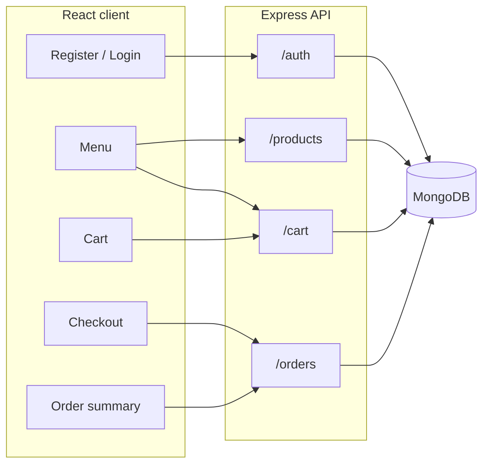

# La Maison — Full-stack restaurant ordering

Classic–modern restaurant branding with a full **register → menu → cart → checkout → order summary** flow. The stack is **React (Vite)**, **Node.js (Express)**, and **MongoDB** (Mongoose).

## System flow

1. **Registration / login**  
   The client sends credentials to `POST /api/auth/register` or `POST /api/auth/login`. The server hashes passwords with bcrypt, issues a **JWT**, and the client stores it in `localStorage` and sends `Authorization: Bearer <token>` on protected calls.

2. **Menu (product listing)**  
   `GET /api/products` returns seeded dishes (categories: Starters, Mains, Desserts, Beverages). The React **Menu** page renders cards and calls `POST /api/cart/items` when the guest chooses **Add to cart** (requires login).

3. **Cart**  
   Each user has one MongoDB **Cart** document. `GET /api/cart` loads populated line items; `PATCH` / `DELETE` adjust quantities or remove lines. Totals are derived on the client from `price × quantity`.

4. **Checkout**  
   **Checkout** collects pickup/contact fields and calls `POST /api/orders/checkout`. The server reads the cart, snapshots line items and prices into an **Order** (so later menu price changes do not alter past orders), clears the cart, and returns the new order id.

5. **Order summary**  
   `GET /api/orders/:id` returns the placed order for the authenticated user only. **My orders** lists history via `GET /api/orders`.



## Prerequisites

- **Node.js** 18+
- **MongoDB** running locally (default `mongodb://127.0.0.1:27017/restaurant_shop`) or set `MONGODB_URI` to [MongoDB Atlas](https://www.mongodb.com/cloud/atlas).

## Setup

### Backend

```bash
cd server
cp .env.example .env
npm install
npm run dev
```

API: `http://localhost:5000` (health: `GET /api/health`).

### Frontend

```bash
cd client
npm install
npm run dev
```

App: `http://localhost:5173` — Vite proxies `/api` to the Express server.

## API overview

| Method | Path | Auth | Description |
|--------|------|------|----------------|
| POST | `/api/auth/register` | No | Create user, return JWT |
| POST | `/api/auth/login` | No | Login, return JWT |
| GET | `/api/auth/me` | Bearer | Current user |
| GET | `/api/products` | No | Menu items |
| GET | `/api/cart` | Bearer | User cart |
| POST | `/api/cart/items` | Bearer | Add line `{ productId, quantity }` |
| PATCH | `/api/cart/items/:productId` | Bearer | Set quantity |
| DELETE | `/api/cart/items/:productId` | Bearer | Remove line |
| POST | `/api/orders/checkout` | Bearer | Body: `customerName`, `phone`, `address`, `notes?` |
| GET | `/api/orders` | Bearer | Order history |
| GET | `/api/orders/:id` | Bearer | Single order |

## Insights

- **JWT + Bearer header** keeps the API stateless and easy to call from React or mobile clients later.
- **Cart vs order**: the cart holds live references to products; the order stores **denormalized** names and prices at purchase time—important for any real commerce or compliance trail.
- **Seeding** runs on server start if the products collection is empty, so a fresh database still shows a full menu.

## Conclusion

This project satisfies the requested **authentication**, **listing**, **cart**, **checkout**, and **order summary** screens with **end-to-end API integration** and a **restaurant-themed** UI. For production you would add HTTPS, stricter validation, rate limiting, payment integration, and admin tools for order status.
